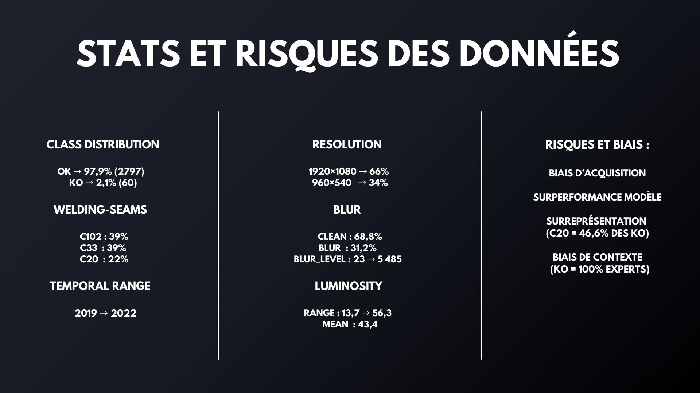

# Pour M. Pasini :

### Noms des contributeurs :

GENTIEU Martin
ROUSSELET Philéas
GUERMOUCH Kenza
JEBBARI Fatima
ROBERT Mathias
ALLIOUI Najlaa
SHANIN Sarah

### Explication globale

Pour le projet, nous avons souhaité conserver la structure intiale du code, nous permettant notamment de travailler sur les différents modules.
Des avancées ont été faites, mais l'intégration n'est pas au point.

Une tentative d'intégration est disponible sur le notebook **Example_solution Phil.ipynb** mais elle ne fonctionne pas complètement.

# Explication par module

### Exploration des données

Une exploration initiale des données :

Cette exploration révèle une répartition inéquitable et biaisée des données, ce qui nécessite de prendre cela en compte lors du chargement des données.

Pour y remédier, le module sur **l'augementation du dataset** a été mis en place.

### Aumgentation

Le module augmentation est représenté par les deux scripts python suivants :
- **challenge_solution/augmentation.py**
- Avec un script de test : **challenge_solution/test_augmentation.py**

Ce module fait plusieurs choses :
- Il génère aléatoirement des corruptions (flou, bruit gaussien, pixels morts, luminosité, rotations)
- Il est capable de créer un dataset qui équilibre les classes sous-représentées (comme la classe KO par rapport à la classe OK)

Le script **test_augmentation.py** fait une implémentation simple du module en générant quelques images augmentées : les images du nom *augmentation_test_....png*

### Dataloader :

Le module est représenté par le script **challenge_solution/torch_dataloader.py**
Le dataloader est la partie de pré-processing ayant pour but de charger le dataset et de transformer les données pour qu'elles puissent être utilisées dans des tenseurs pytorch normalisés.

Cela permet au réseau d'étudier les composantes principales, en normalisant les valeurs des tenseurs entre 0 et 1 pour les images.

Dans notre cas, une tentative a été faite pour intégrer les composantes du module **augmentation.py** afin de pouvoir générer automatiquement des données corrompues et enrichies.
Une option a également été mise en place pour générer soit un dataset d'entraînement (shuffled et augmenté) ou un dataset de validation (sans modification)

Cela permet lors de l'implémentation d'avoir uniquement à appelé ces deux fonctions pour obtenir des datasets prêts à l'emploi pour les modèles pytorch.

### OOD detection

### Autre modèle

### Implémentation partielle

